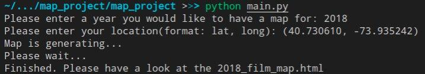
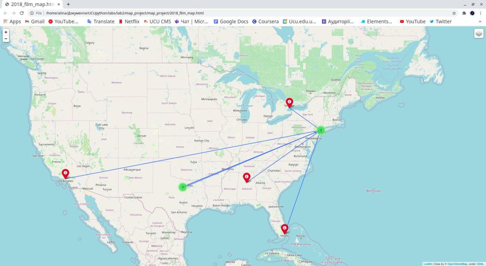
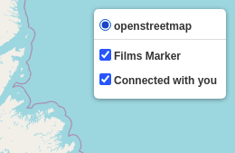

# map project

## information about the purpose of the module:
This module is for creating a web map (html page).
The web map shows information about the locations of films that were shot in a particular year.
The user indicates for the films for which year he wants to build a map and his location as latitude and longitude (e.g. 49.83826,24.02324), and as a result receives an HTML file.

The map contains three layers:
1. Main layer;
2. Films Markers layer - >= 10 labels of the nearest filming locations are shown;
3. 'Connected with you' a layer that connects the user's location and the label on the map.
The last two layers can be removed from the display by checking the box in the upper right corner next to the layer name.

## a brief conclusion about the information provided to us by such a card;

With this map, the user has the opportunity to learn about interesting places that may have seen in the movies. And given that the map generates the next 10 tags, the probability that the user will be able to visit these places and see for themselves increases.

## example of startup (year and location) of input and screenshot of generated map;
This is an example of working proccess and result of programm with 2018 year and (40.730610, -73.935242) user location:

This is a map from generated html-file opened in browser:

Markers that are close to each others are grouped into the clusters. Also, you can see the lines connected to New York (user input location).

Layer controler:

And by clicking on the marker icon, user can learn what movie where filmed in certain location.

## License
[MIT](https://github.com/alinamuliak/map_project/blob/main/LICENSE)